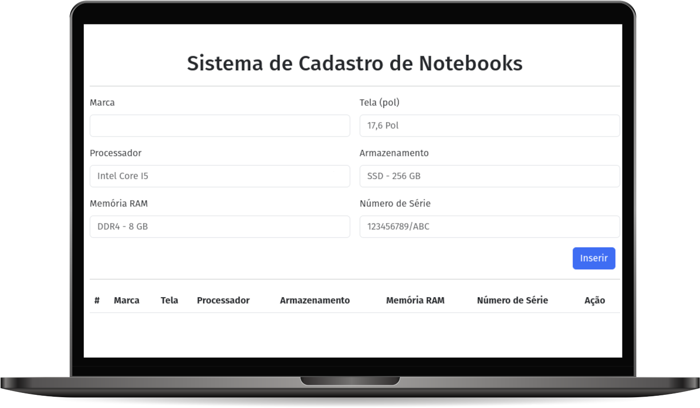

# CADASTROS DE NOTEBOOKS

Nesta prática você deverá adaptar o código disponibilizado relacionado a um Sistema de Cadastros.

Após escolher o tema para elaboração da sua tarefa, você deverá identificar seis características para o tema escolhido.

Por exemplo, no tema de clientes, as características poderiam ser: nome, e-mail, celular, estado, data de nascimento e CPF.

Importante: para o seu tema você NÃO poderá escolher as características e-mail, celular e estado. Isso, para garantir que você irá adaptar o arquivo index.html para características do seu tema.

Assim como no código disponibilizado, seu sistema deverá possuir funções para inserir e excluir.

As validações de preenchimento obrigatório também devem ser realizadas para todos os campos. Opcionalmente, você poderia configurar outras validações simples para os campos (formatos, quantidade de caracteres, valores máximos e mínimos, etc.).

Pelo menos, uma validação customizada deve ser realizada. No exemplo de código disponibilizado, a validação customizada foi relacionada ao campo celular. Neste caso, o sistema não permite que sejam cadastrados clientes com o mesmo número de celular. Para o seu tema, você pode escolher qualquer tipo de validação, relacionada a qualquer campo. Desde que seja uma validação customizada utilizando a linguagem JavaScript.

 ## Objetivos de aprendizagem
 1. Utilizar DOM para manipular elementos HTML 

## Tecnologias utilizadas  

1. HTML
2. CSS
3. JavaScript

## Projeto em execução

 

[Visualizar Projeto](https://replit.com/@GabrielMorozini/Sistema-de-Cadastros?v=1)

obs.: Para funcionar corretamente você deve clicar em "Open WebSite" no menu superior.

 

  
  
     

