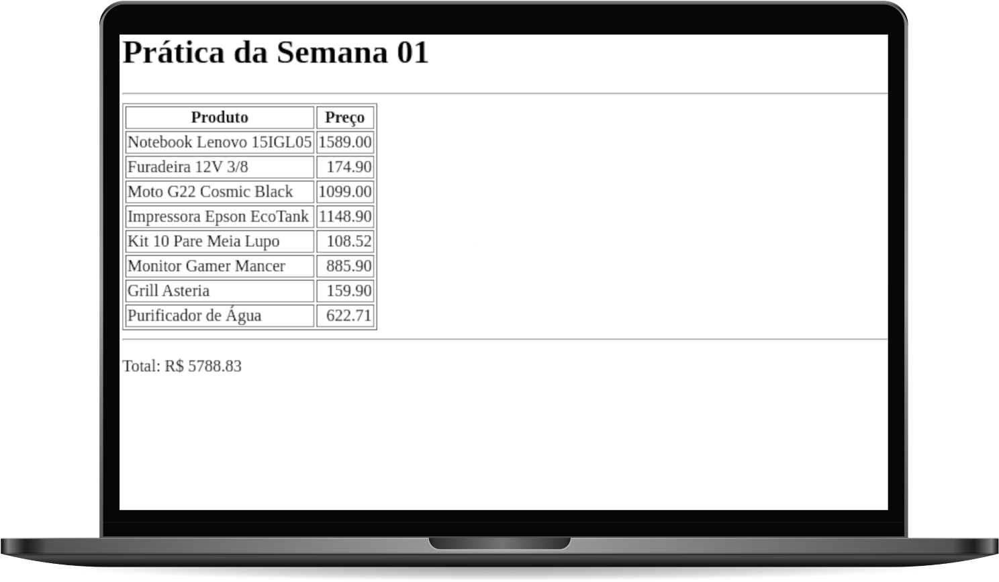

# TABELA DE PREÇOS

Elabore um código no arquivo script.js para ler o preço de cada um dos produtos de uma tabela na página index.html. Utilizando JavaScript, escreva o valor da soma dos preços dos produtos ao final da página.

 ## Objetivos de aprendizagem
 1. Utilizar DOM para manipular elementos HTML 

## Tecnologias utilizadas  

1. HTML
2. CSS
3. JavaScript

## Projeto em execução

 

[Visualizar Projeto](https://replit.com/@GabrielMorozini/Precos-Tabela?v=1)

 

  
  
     

